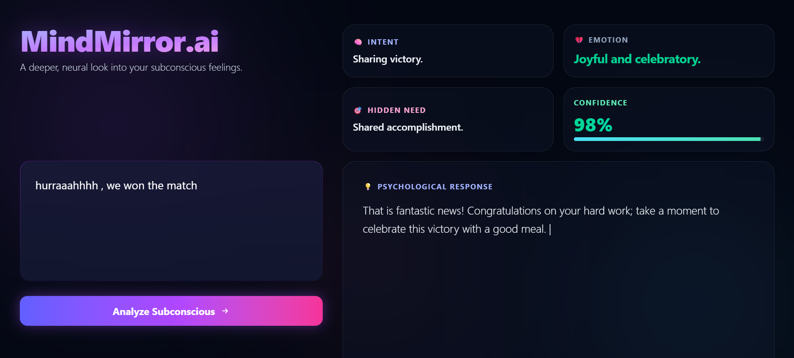

# 🧠 MindMirror.ai

> A deeper, neural look into your subconscious feelings.

MindMirror AI is a powerful, dual-tier hackathon project that takes a simple sentence detailing how a user feels and dynamically extracts a deeply structured psychological analysis. 

Built with an ultra-premium glassmorphic Next.js interface and powered by a highly efficient, custom zero-latency FastAPI Python engine running the **smolify/smolified-mindmirror-ai** model.

## 🚀 The Problem & Our Specialized Solution

### The Problem
When humans are overwhelmed, they often struggle to articulate their true emotions and underlying psychobiological needs. Vague, frustrated statements like *"I am tired of studying"* or *"Everything is falling apart"* lack actionable emotional intelligence. MindMirror AI solves this by acting as an instant cognitive translator that decodes raw stress into defined intents, core emotions, and hidden needs.

### Why a Specialized Model is Better than a General LLM
While massive General LLMs (like GPT-4) can perform this task, our specialized `0.3B parameter` model (`smolified-mindmirror-ai`) is vastly superior for this specific application for three critical reasons:
1. **Absolute Privacy**: Mental health data is highly sensitive. General LLMs require streaming personal thoughts to corporate clouds. Our specialized, lightweight model runs **100% locally** on the user's hardware (via FastAPI), ensuring zero data leaves the device.
2. **Structured Reliability**: General LLMs are conversational and prone to rambling or breaking JSON structural constraints. Our model was synthetically distilled to focus *strictly* on our formatted emotional outputs (Intent, Emotion, Needs, Actions) with incredibly high structural fidelity, completely removing conversational bloat.
3. **Zero Latency & Edge Deployment**: By avoiding round-trip cloud API delays, our efficient architecture provides instantaneous bio-feedback exactly at the moment of distress, proving that massive intelligence can be effectively shrunk for edge hardware.

---

## ✨ Features
- **🔮 Neural Aesthetics**: A stunning, mobile-responsive dark-theme UI composed of glass-cards, animated laser scanners, deep neon orb backdrops, and seamless staggering page transitions.
- **⚡ Two-Tier Architecture**: A beautiful `React/Next.js` frontend connected synchronously via REST to an advanced local `FastAPI` instance.
- **🤖 Custom AI Execution**: Leverages the blazing fast `gemma3_text` parameters model running 100% locally on your own CPU/GPU hardware. No cloud limits, no internet latency, no subscription keys required.
- **📊 Real-time Sentiment Parsing**: Instantly categorizes freeform human emotion into actionable *Intent, Core Emotion, Hidden Needs*, and the full *Psychological Response* dynamically, with dynamically generated Confidence Scores.

---

## 🎯 Primary Use Cases

1. **Self-Guided Mental Health Triage**: Acts as a low-barrier journaling tool to help users instantly identify the root causes of their stress or anxiety before seeking professional help.
2. **Emotional Intelligence Training**: Helps individuals articulate vague feelings (e.g., "I feel bad") into highly specific emotional categories and hidden psychological components.
3. **Burnout Prevention**: A daily cognitive check-in companion for students or professionals to map their subconscious neural pathways and detect early signs of severe fatigue or misalignment.

---

## 🚀 Getting Started

MindMirror consists of two perfectly synchronized running systems: the **Next.js UI Frontend**, and the **Python Engine Backend**.

### 1. Boot the Python Backend (The Brain)
Open your first terminal window and navigate inside the `backend` folder.

```bash
cd backend
pip install -r requirements.txt
python main.py
```
> [!NOTE]
> The very first time you launch `main.py`, it will securely download the `smolified-mindmirror-ai` Hugging Face weights strictly onto your local machine.

### 2. Boot the Next.js Frontend (The Face)
Open a second terminal window at the root project directory (`mind-mirror`).

```bash
npm install
npm run dev
```

Navigate to **[http://localhost:3000](http://localhost:3000)** in your browser to start analyzing the subconscious!

---

## 🛠️ Technology Stack

| Layer | Technology | Usage |
| --- | --- | --- |
| **Frontend UI** | Next.js 16, React 19, TailwindCSS v4 | High-fidelity GUI, Glassmorfism, Animations, Responsive layout |
| **Backend API** | Python, FastAPI, Uvicorn | Ultra-fast local REST inference server bypassing CORS limits |
| **AI Processing** | PyTorch, Transformers, Accelerate | Hardware-accelerated local Machine Learning processing |
| **The Model** | `amitava2004/smolified-mindmirror-ai` | Highly-distilled, domain-specific text generation capability |

---

## 📸 Example Output
Here is an example of `smolified-mindmirror-ai` processing raw emotional input into highly structured psychological data on our UI:



---

## 🧬 Powered by Smolify AI
Our backend relies strictly on models distilled and formulated through **Smolify AI**. We use `smolify/smolified-mindmirror-ai` run natively on local hardware because:
1. **Zero Latency**: By running our `0.3B parameter` gemma3-based models completely locally via FastAPI, we bypass the round-trip API delays of huge LLM cloud providers entirely.
2. **Domain-Specific Reasoning**: The model isn't just a chatbot; it was synthetically distilled to focus strictly on our formatted emotional outputs (Intent, Emotion, Needs, Actions) with incredibly high structural fidelity matching much larger engines.
